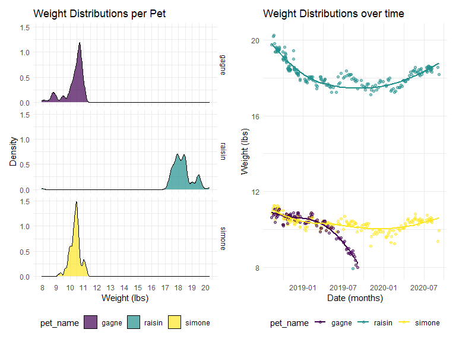

Data Science I (P8105) Midterm
================
Salah El-Sadek (sne2114)

### Problem 1

     The dog weights dataset includes data on the weights of three pet
dogs: Raisin, Simone, and Gagne. Weight was recorded for each pet in
pounds and ounces along with the standard deviation for weight
measurements and date the pets were weighed. Notes are also included on
some dates to explain things such as missing data for any of the pets,
for example. The goal is to analyze any trends or changes to each pet’s
weight as a way to keep track of any potential health issues.

     Import and clean dog weights data set, skipping first header row
and omitting notes column. The column type for the column ‘date’ was
changed to numeric then into date format, since ‘date’ values in excel
are custom (numerically coded) formats, not date formats.

``` r
weights_tidy = 
  read_excel(
    "./data/dogweights_07sept2020.xlsx", skip = 1) %>%
  janitor::clean_names() %>%
  select(-x6) %>%
  mutate(
    date = as.numeric(date),
    date = as.Date(date, origin = "1899-12-30"))
```

    ## New names:
    ## * `` -> ...6

``` r
weights_tidy
```

    ## # A tibble: 205 x 5
    ##    date       raisin simone gagne std    
    ##    <date>     <chr>  <chr>  <chr> <chr>  
    ##  1 2018-08-12 19 12  10 14  10 10 <NA>   
    ##  2 2018-08-19 20 03  11 02  10 12 20 15.8
    ##  3 2018-08-22 20 04  11 04  10 13 20 15.6
    ##  4 2018-08-24 19 13  11 04  11 01 20 15.6
    ##  5 2018-08-27 19 06  10 08  10 06 20 15.6
    ##  6 2018-08-28 <NA>   <NA>   <NA>  <NA>   
    ##  7 2018-08-29 19 06  11 00  11 01 20 15.6
    ##  8 2018-08-30 <NA>   <NA>   <NA>  <NA>   
    ##  9 2018-08-31 19 09  11 00  10 12 20 15.6
    ## 10 2018-09-01 <NA>   <NA>   <NA>  <NA>   
    ## # ... with 195 more rows

     Used pivot\_longer to rearrange weight measurement per pet name.
Also helps with not dropping rows with weight data missing from only 1
or 2 pets. Rows with improper dates were also omitted (one row). The
weight column containing weight measurements was separated into lbs and
oz, the oz values divided by 16 then summed with the lbs to give a total
weight in pounds for each entry .Same was done to standard deviation
column as well.

``` r
weights_tidy = 
  weights_tidy %>% 
  pivot_longer(
    raisin:gagne,
    names_to = "pet_name",
    values_to = "weight_lbs_oz") %>% 
  drop_na(weight_lbs_oz) %>% 
  separate(
    weight_lbs_oz,
    into = c("weight_lbs", "weight_oz"),
    sep = "\\s", extra = "merge") %>% 
  separate(
    std,
    into = c("std_lbs", "std_oz"),
    sep = "\\s", extra = "merge") %>% 
  mutate(
    weight_lbs = as.numeric(weight_lbs),
    std_lbs = as.numeric(std_lbs),
    weight_oz = as.numeric(weight_oz),
    std_oz = as.numeric(std_oz))

weights_tidy
```

    ## # A tibble: 515 x 6
    ##    date       std_lbs std_oz pet_name weight_lbs weight_oz
    ##    <date>       <dbl>  <dbl> <chr>         <dbl>     <dbl>
    ##  1 2018-08-12      NA   NA   raisin           19        12
    ##  2 2018-08-12      NA   NA   simone           10        14
    ##  3 2018-08-12      NA   NA   gagne            10        10
    ##  4 2018-08-19      20   15.8 raisin           20         3
    ##  5 2018-08-19      20   15.8 simone           11         2
    ##  6 2018-08-19      20   15.8 gagne            10        12
    ##  7 2018-08-22      20   15.6 raisin           20         4
    ##  8 2018-08-22      20   15.6 simone           11         4
    ##  9 2018-08-22      20   15.6 gagne            10        13
    ## 10 2018-08-24      20   15.6 raisin           19        13
    ## # ... with 505 more rows

``` r
weights_tidy =
  weights_tidy %>% 
  mutate(
    weight_oz = weight_oz / 16,
    std_oz = std_oz / 16,
    total_weight_lbs = weight_lbs + weight_oz,
    total_std_lbs = std_lbs + std_oz) %>% 
  select(date, pet_name, total_weight_lbs, total_std_lbs) %>% 
  drop_na(total_weight_lbs)

weights_tidy
```

    ## # A tibble: 513 x 4
    ##    date       pet_name total_weight_lbs total_std_lbs
    ##    <date>     <chr>               <dbl>         <dbl>
    ##  1 2018-08-12 raisin               19.8          NA  
    ##  2 2018-08-12 simone               10.9          NA  
    ##  3 2018-08-12 gagne                10.6          NA  
    ##  4 2018-08-19 raisin               20.2          21.0
    ##  5 2018-08-19 simone               11.1          21.0
    ##  6 2018-08-19 gagne                10.8          21.0
    ##  7 2018-08-22 raisin               20.2          21.0
    ##  8 2018-08-22 simone               11.2          21.0
    ##  9 2018-08-22 gagne                10.8          21.0
    ## 10 2018-08-24 raisin               19.8          21.0
    ## # ... with 503 more rows

     Creating a data frame with only notes and dates they were recorded.
Similar method to tidying the weight\_tidy data frame.

``` r
notes_tidy = 
  read_excel(
    "./data/dogweights_07sept2020.xlsx", skip = 1) %>%
  janitor::clean_names() %>%
  select(date, x6) %>%
  mutate(
    date = as.numeric(date),
    date = as.Date(date, origin = "1899-12-30")) %>% 
  rename(notes = x6) %>% 
  drop_na(notes)
```

    ## New names:
    ## * `` -> ...6

``` r
notes_tidy
```

    ## # A tibble: 14 x 2
    ##    date       notes                                                             
    ##    <date>     <chr>                                                             
    ##  1 2018-08-27 Right after leaving for 3 days at Weber's                         
    ##  2 2018-09-04 at camp bow wow                                                   
    ##  3 2018-10-01 dogs at Webers from Sept 18-30                                    
    ##  4 2018-10-09 dogs at Webers from Oct 5-8                                       
    ##  5 2018-10-16 on 10/15 all had hair cuts                                        
    ##  6 2018-10-22 dogs at Webers from Oct 18-22                                     
    ##  7 2018-11-18 dogs at Webers from Nov 10-17                                     
    ##  8 2019-01-08 Simone/Gagne  at Webers from Dec 20-Jan 4, Raisin at PC Dec 20-Ja~
    ##  9 2019-09-06 Gagne died 9/8/2019                                               
    ## 10 2019-11-04 on vacation? Dogs at kennel?                                      
    ## 11 2020-02-03 at Kennel?                                                        
    ## 12 2020-05-23 first haircut in 3-4 months                                       
    ## 13 2020-06-23 in PC June 23-July 10, no wts taken, Raisin with us, Simone in ke~
    ## 14 2020-08-07 in Denver and PC aug 9-aug 31, no wts taken, Raisin with us, Simo~

     Exporting the weights\_tidy and notes\_tidy data frames.

``` r
write_csv(weights_tidy, "./data/weights_df.csv")
write_csv(notes_tidy, "./data/notes_df.csv")
```

### Problem 2

     Our weights\_tidy data set is ordered by date and includes weight
data in both pounds and ounces (and their standard deviations) for each
dog by pet\_name.Number of unique dates were isolated by creating a new
data frame (n\_dates) with duplicate dates eliminated then counting the
number of rows.

``` r
n_dates = 
  weights_tidy %>% 
  distinct(date)

n_dates
```

    ## # A tibble: 202 x 1
    ##    date      
    ##    <date>    
    ##  1 2018-08-12
    ##  2 2018-08-19
    ##  3 2018-08-22
    ##  4 2018-08-24
    ##  5 2018-08-27
    ##  6 2018-08-29
    ##  7 2018-08-31
    ##  8 2018-09-02
    ##  9 2018-09-03
    ## 10 2018-09-04
    ## # ... with 192 more rows

     Number of unique dates is equal to **202**

     Constructed a summary table including mean weight, mean standard
deviation, and number of observations for each dog. This was done by
first grouping by pet name and finding the means for each dog without
including any missing values. Summary table was produced using the
‘kable’ command from the knitr package.

``` r
summary_table =
  weights_tidy %>% 
    group_by(pet_name) %>% 
    summarize(
      n_obs = n(),
      mean_weight_lbs = mean(total_weight_lbs, na.rm = TRUE),
      mean_std_lbs = mean(total_std_lbs, na.rm = TRUE))
```

    ## `summarise()` ungrouping output (override with `.groups` argument)

**Summary Table**

| pet\_name | n\_obs | mean\_weight\_lbs | mean\_std\_lbs |
| :-------- | -----: | ----------------: | -------------: |
| gagne     |    120 |          10.29531 |         20.975 |
| raisin    |    200 |          18.22375 |         20.975 |
| simone    |    193 |          10.37824 |         20.975 |

### Problem 3

     Constructing a two-panel plot with the left panel showing the
weight distribution for each pet in a density plot, and the right panel
showing the distribution of weights of each dog over time in a scatter
plot.

``` r
weight_dist_plot =
  weights_tidy %>% 
  ggplot(aes(x = total_weight_lbs, fill = pet_name)) +
  geom_density(alpha = .7, adjust = .7) + 
  labs(
    title = "Weight Distributions per Pet",
    x = "Weight (lbs)",
    y = "Density") +
  scale_x_continuous(
    breaks = c(8, 9, 10, 11, 12, 13, 14, 15, 16, 17, 18, 19, 20, 21)) +
  facet_grid(pet_name ~ .)

weight_time_plot =
  weights_tidy %>% 
  ggplot(aes(x = date, y = total_weight_lbs, color = pet_name)) + 
  geom_point(alpha = .5) +
  geom_smooth(se = FALSE) +
  labs(
    title = "Weight Distributions over time",
    x = "Date (months)",
    y = "Weight (lbs)")

weight_dist_plot + weight_time_plot
```

    ## `geom_smooth()` using method = 'loess' and formula 'y ~ x'



     A striking observation is that of how Gagne’s weight was in
constant decline until Gagne passed away in September of 2019. Raisin
and Simone both experienced dips in their weight throughout the year
2019.  
     Weight distributions for Gagne and Simone were similar and focused
around the 10.5 lbs value. While for Raisin, the weight distribution is
‘wider’ with a focus on weights ranging from 17 to 19 lbs.
